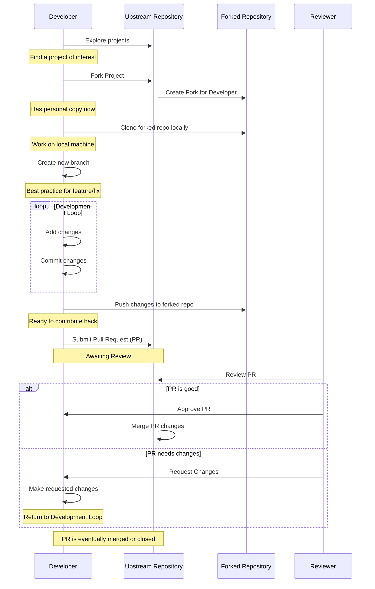

<!--
Welcome to bangladeshos! Great to have you here :)
Before you edit this file, please be sure you've read the .github/CONTRIBUTING.md guide
As a lot of the content here is auto-generated by the scripts in /lib, via GH actions
So if you edit anything between the xx-start / xx-end tags - it will be over-written!!
-->

<h1 align="center">Bangladesh Open Source!</h1>

<p align="center">
<a><br /></a>
<b><i>Tools and resources to help you get started with open source</i></b>
<br />
<i>Create your first pull request here!</i><br />
<b>🌐 <a href="https://bangladeshos.github.io/">bangladeshos.github.io</a></b><br />
</p>

<details open>
<summary><b>Contents</b></summary>

- [📚 Guides and Resources](#guides-and-resources)
- [🛣️ Roadmap](#roadmap)
- [👾 Bangladesh OpenSource](#bangladeshos)
- [🗃 Finding Projects](#finding-projects)
- [🫵 Contributing](#contributing)
- [⚖️ License](#license)

<details>
  <summary><a href="#repo-admin">📂 Repository Admin</a></summary>

  - [🌐 Website](#website)
  - [🪞 Mirror](#mirror)
  - [📜 Policies](#policies)
  - [🤖 Automations](#automations)
  - [🎖️ Credits](#service-credits)
  - [💖 Supporters](#supporters)
  - [👥 Contributors](#contributors)
  
</details>

</details>

## Intro

The aim of this repo is to provide a roadmap, along with some helpful guides and resources to help anyone, of any level to get into open source.

Why? Because open source is awesome! It's the backbone for almost all modern software, and has enabled people from all over the world collaborate to build eipc stuff. It's a place where everyone has a chance to learn, contribute, and make an impact. The beauty of open source lies in its accessibility and inclusivity, with welcoming communities which are open to anyone.

If you're new here, and looking to make your first pull request, check out the [Git in](#bangladeshos) section below, where you can submit a PR and have your name included on the list!

---

## Guides and Resources

#### Open Source Guides
<!-- guides-start -->
-  [Why Open Source?](/guides/why-open-source.md)
-  [Submit your first PR (UI)](/guides/submit-your-first-pr-ui.md)
-  [Full Local Git Setup](/guides/local-git-setup.md)
-  [Submit your first PR (CLI)](/guides/submit-your-first-pr-cli.md)
-  [Open Source for Businesses](/guides/open-source-for-businesses.md)
<!-- guides-end -->

#### External Resources
<!-- resources-start -->
-  [Simple Introduction to Git](https://rogerdudler.github.io/git-guide/)
-  [Open Source Guides from GitHub](https://opensource.guide/)
-  [Good First Issue - Find beginner-friendly tickets](https://goodfirstissue.dev/)
-  [First Contributions - Find projects to contribute to](https://firstcontributions.github.io/)
-  [Code Triage - Find Projects to Contribute to](https://www.codetriage.com/)
-  [Outreachy - Paid Open Source Internships for Beginners](https://www.outreachy.org/)
-  [Learn Git - Comprehensive yet simple guide from BitBucket](https://www.atlassian.com/git/tutorials/learn-git-with-bitbucket-cloud)
-  [Git Immersion - Quick walk through of Git](https://gitimmersion.com)
-  [Git Tips & Tricks](https://github.com/git-tips/tips)
-  [GitHub Cheatsheet and Hidden Features](https://github.com/tiimgreen/github-cheat-sheet)
-  [Git GUIs for Windows, Mac and Linux](https://git-scm.com/downloads/guis)
-  [All about Git Hooks](https://githooks.com/)
-  [Effective branching patterns of larger teams](https://martinfowler.com/articles/branching-patterns.html)
-  [Choose an open source license](https://choosealicense.com/)
-  [Git Command Explorer](https://gitexplorer.com/)
<!-- resources-end -->

<p align="right"><sup><a href="#bangladeshos">⬆️ Back to Top</a></sup></p>

---

## Roadmap

The following roadmap covers all the core skills and areas you may want to research, if you're looking to become an open source master. 

This idea was inspired by [roadmap.sh](https://roadmap.sh/) - which you should definitely check out if you haven't already! They provide some awesome developer roadmaps and learning pathways for various tech stacks.

<!-- roadmap-start -->
<details>
<summary><sub>🦯 Click here if you cannot see the chart</sub></summary>

This diagram is written using Mermaid- [view the chart source here](https://mermaid.live/edit#pako:eNp9V39v2zYQ/SpEijQqYKOz86Oth26ILcsO4LRekrYY0H8o6WRxoUmBpJx4Rb77jqIoy3I8BLDl3CN59+7dHfXrJJEpnIzIyenpr5+CECaYGZHqkZAzk8MazkbkLKYaznrt/36nitGYgz5r4GgqFFtTtZ1ILpVd9ya9+HSRZX7pDvEAz2aHGlzh38dD1FiqFNT/4DgTsDNfxZDBby2zhkSKdM+hy+jyIrxsYQwow/YgGTrszC/2Cz9eTk9/ip9ipWiRk8WdfbZmbbYcyDXJGOejNx8uP9H08ve2aVybPiUfrwD2TJPjpvC4aXrcFB03zY6b5q+Z3Od1kNFRRvtWIf1YUZHk5GsBgtzLUiXoJmyAywIUuZM0XdPinefl9JTcG7oCMqh3Ip8//0HG9X4Fp1tvH5EbYZRMy8QwKd45+NjBB8GPnBrCdPvUPz1mQPp9C6LBMmdcalnkW/KWLBUTCStQl11gHIxBQMaMJn2CyeY0loraY3vkAaPTBVUgkm0Pjet1iXWw7W6RBJOccg5iBXaTBUtAaCZWPTKTG1ACKYIeuS+1oUzQmHG3R4eUYZuUSU3Kkz0794gRiUrU7RqEoZw8SMl9OBO3ahB8B6XRd3TWEsjJEzM5mTHjcc7nCfIzppol1t8bjKlHrtPUhWh/LEud20/Ou+uQrirlGB7SegtqhU9dUBLMqUi5xaAfGWeJ0V1Mirxrg4mhmOOkysteKMPgm+XQ+j4v4/f4taDx+zEzcZk8QhPP0G03pMEdFFIzIxUD3SM3WpeYDcz8ne5i4yCS6tFuvtFkwqVoheAxSeAOJteVBCtx3LyfhMTRdpi+83b6wlaNePuIhGwD2EmNRFbS3ZlhdWQ4CJYseSSULKhYlbjEmwe1vUnZW0zWxooqRQ0Uzps9ZBwsGFamZQLBkULFPGHEBzgUrtc04u7LopDKNKGFLpRhsFTyH0gMBqKwIEsFCA5Bs5UgS2qwUYpmZ0dfiOn4JrBFo+KFjXSvQWDwYAdHd01ceYPavVaoLwP2KJT5sSOs88juXyXltf/2MKrSV5Jz0U7O1DcckNgQ+nZWeNiITMWKWkm7wsGRdlD2U7fJIIiYi82C7tgqt2KuiPJAR/MUEzeTMiURQz6cMNHbMeAxArtkhGnCYtl2V8We9zNNvjNdNaSZpBzFjXEeNNfaraFPaVL1MHL/iH3cczd13E0xPU2cTKAudVJqe8IBMK7KCichIsflysppKnKrPduEDuB1Tu5gw+CJTE3u5Hqk0pv0XLbTE9XpwVNS3c8ltyT3URE89fARuaWP4Hoci0vT8jxyewyCUCZl1SgrGt6SB/RhV3ORYznC3PxQrApvwoEqsresC45R1cz4repN+6HCuhZ+7tnFTYS1N8MAucP8P7t6BFoV0StERo7ICBMUQlyuqgxh2VGDaoEDlK2YZmB5zfpqvcVhYwcOVmHXn/OmpHcDynZzKpDeOoAKfu4OOu+W806ZrQ1uMfW8uxIFJPE+IbO2P71d6qSq9fxNtx1tpHHVlsaslgb2NpRtDRgd6YYzt2QQtHtPM5s9yKV2hjqom49DVIP89uYBS265wOFY0CSH7hqkP5eymlLUryOZVORvPKzVDPb8GQb7FwHLuxRg2L9tyc1cimdWCFJUFsuakk9pVlY5QM9wEDfKaRbELt6JVHjnCLE5tu8jS8pS3+ddvl6h/EOb8nlNuZJ26nrEyIX49Ul0et7cLRoECHRdg5Iv2Ao6KMfgfGBlnjE7f+sWZ9t4gpfHLjBuTapxyaqe0FXsnge2Dwp0oJSltpdJWCnfCUIouNy2ZD533M2RbDfjl6wAOxZ0lc2WfroL4qC6hKFW8Kq4wSvp5AazxFTCwT7tXyG6Lu6qcAHUVlfOiupOJewlppHo3JXSHIvwS6mwc9jQLaftGupi4+AejGmRZB+nzwWeRr0zJz1ysga1Rk3gm96vk+r9zb7zpZDRkpuTl5f/AJm9R4I=)

```mermaid
%%{
  init: {
    'theme': 'base',
    'themeVariables': {
      'primaryColor': '#d494ff',
      'primaryTextColor': '#161618',
      'primaryBorderColor': '#161618',
      'lineColor': '#6befe0',
      'secondaryColor': '#5F54D5',
      'tertiaryColor': '#fff'
    }
  }
}%%

graph LR

    style A fill:#759ad5;
    style B fill:#9c86ee;
    style C fill:#9c86ee;
    style D fill:#9c86ee;
    style E fill:#9c86ee;
    style F fill:#9c86ee;
    style G fill:#9c86ee;
    style H fill:#9c86ee;
    
    A(fa:fa-code-branch Open Source Developer Roadmap)

    %% Stage 1
    A ==> B(fa:fa-play Stage 1: Introduction)
    B ==> B1(What is Open Source?)
    B1 --> B1a(Philosophy & Principles)
    B1 --> B1b(Benefits - Collaboration, Transparency, Community)
    B1 --> B1c(Challenges - Licensing, Governance, Sustainability)

    %% Stage 2
    A ==> C(fa:fa-wrench Stage 2: Fundamental Tools)
    C ==> C1(Version Control with Git)
    C1 --> C1a(Basics - Init, Add, Commit, Push, Pull)
    C1 --> C1b(Branching & Merging)
    C1 --> C1c(Handling Conflicts)
    C1 --> C1d(Best Practices)

    C ==> C2(Using GitHub/GitLab/Bitbucket)
    C2 --> C2a(Repositories, Issues & PRs)
    C2 --> C2b(Forking vs Cloning)
    C2 --> C2c(GitHub Actions - CI/CD Basics)

    %% Stage 3
    A ==> D(fa:fa-code Stage 3: Dive into Coding)
    D --> D1(Pick a Language)
    D1 --> D1a(Basics & Advanced Topics)
    D1 --> D1b(Libraries & Frameworks)
    D1 --> D1c(Community & Support)

    D ==> D2(Project Structure & Design Patterns)
    D2 --> D2a(Understanding Open Source Codebase)
    D2 --> D2b(Common Architectural Patterns)
    D2 --> D2c(Code Quality & Standards)

    %% Stage 4
    A ==> E(fa:fa-people-line Stage 4: Engaging with the Community)
    E ==> E1(Finding the Right Project)
    E1 --> E1a(Good First Issue & Beginner Friendly)
    E1 --> E1b(Project's Vision, Goals, and Roadmap)

    E ==> E2(Communication Skills)
    E2 --> E2a(Engaging in Discussions)
    E2 --> E2b(Reporting Bugs & Enhancements)
    E2 --> E2c(Code Review Ethics & Best Practices)

    %% Stage 5
    A ==> F(fa:fa-hands-holding-child Stage 5: Make Contributions)
    F ==> F1(Documentation & Testing)
    F1 --> F1a(Writing Clear Documentation)
    F1 --> F1b(Unit Testing & Test-Driven Development)

    F ==> F2(Bug Fixes & Feature Enhancements)
    F2 --> F2a(Debugging Strategies)
    F2 --> F2b(Collaborating with Project Maintainers)

    F ==> F3(Project Governance & Management)
    F3 --> F3a(Understanding Project's Governance Model)
    F3 --> F3b(Role of Maintainers, Contributors, and Users)

    %% Stage 6
    A ==> G(fa:fa-brain Stage 6: Advanced Topics)
    G ==> G1(Open Source Licensing)
    G1 --> G1a(Common Licenses - MIT, GPL, Apache)
    G1 --> G1b(Choosing a License for Your Project)

    G ==> G2(Sustainability & Monetization)
    G2 --> G2a(Donations, Crowdfunding, Grants)
    G2 --> G2b(Open Core, Dual Licensing, Paid Support Models)

    %% Stage 7
    A ==> H(fa:fa-rocket Stage 7: Your Own Project)
    H ==> H1(Starting a New Project)
    H1 --> H1a(Defining Vision & Scope)
    H1 --> H1b(Community Building & Management)

    H ==> H2(Continuous Integration & Deployment)
    H2 --> H2a(CI/CD Pipelines for Open Source)
    H2 --> H2b(Tools - Travis CI, CircleCI, GitHub Actions)

    H ==> H3(Project Leadership & Mentoring)
    H3 --> H3a(Nurturing New Contributors)
    H3 --> H3b(Setting & Managing Expectations)

```

[](https://mermaid.live/view#pako:eNp9V39v2zYQ/SpEijQqYKOz86Oth26ILcsO4LRekrYY0H8o6WRxoUmBpJx4Rb77jqIoy3I8BLDl3CN59+7dHfXrJJEpnIzIyenpr5+CECaYGZHqkZAzk8MazkbkLKYaznrt/36nitGYgz5r4GgqFFtTtZ1ILpVd9ya9+HSRZX7pDvEAz2aHGlzh38dD1FiqFNT/4DgTsDNfxZDBby2zhkSKdM+hy+jyIrxsYQwow/YgGTrszC/2Cz9eTk9/ip9ipWiRk8WdfbZmbbYcyDXJGOejNx8uP9H08ve2aVybPiUfrwD2TJPjpvC4aXrcFB03zY6b5q+Z3Od1kNFRRvtWIf1YUZHk5GsBgtzLUiXoJmyAywIUuZM0XdPinefl9JTcG7oCMqh3Ip8//0HG9X4Fp1tvH5EbYZRMy8QwKd45+NjBB8GPnBrCdPvUPz1mQPp9C6LBMmdcalnkW/KWLBUTCStQl11gHIxBQMaMJn2CyeY0loraY3vkAaPTBVUgkm0Pjet1iXWw7W6RBJOccg5iBXaTBUtAaCZWPTKTG1ACKYIeuS+1oUzQmHG3R4eUYZuUSU3Kkz0794gRiUrU7RqEoZw8SMl9OBO3ahB8B6XRd3TWEsjJEzM5mTHjcc7nCfIzppol1t8bjKlHrtPUhWh/LEud20/Ou+uQrirlGB7SegtqhU9dUBLMqUi5xaAfGWeJ0V1Mirxrg4mhmOOkysteKMPgm+XQ+j4v4/f4taDx+zEzcZk8QhPP0G03pMEdFFIzIxUD3SM3WpeYDcz8ne5i4yCS6tFuvtFkwqVoheAxSeAOJteVBCtx3LyfhMTRdpi+83b6wlaNePuIhGwD2EmNRFbS3ZlhdWQ4CJYseSSULKhYlbjEmwe1vUnZW0zWxooqRQ0Uzps9ZBwsGFamZQLBkULFPGHEBzgUrtc04u7LopDKNKGFLpRhsFTyH0gMBqKwIEsFCA5Bs5UgS2qwUYpmZ0dfiOn4JrBFo+KFjXSvQWDwYAdHd01ceYPavVaoLwP2KJT5sSOs88juXyXltf/2MKrSV5Jz0U7O1DcckNgQ+nZWeNiITMWKWkm7wsGRdlD2U7fJIIiYi82C7tgqt2KuiPJAR/MUEzeTMiURQz6cMNHbMeAxArtkhGnCYtl2V8We9zNNvjNdNaSZpBzFjXEeNNfaraFPaVL1MHL/iH3cczd13E0xPU2cTKAudVJqe8IBMK7KCichIsflysppKnKrPduEDuB1Tu5gw+CJTE3u5Hqk0pv0XLbTE9XpwVNS3c8ltyT3URE89fARuaWP4Hoci0vT8jxyewyCUCZl1SgrGt6SB/RhV3ORYznC3PxQrApvwoEqsresC45R1cz4repN+6HCuhZ+7tnFTYS1N8MAucP8P7t6BFoV0StERo7ICBMUQlyuqgxh2VGDaoEDlK2YZmB5zfpqvcVhYwcOVmHXn/OmpHcDynZzKpDeOoAKfu4OOu+W806ZrQ1uMfW8uxIFJPE+IbO2P71d6qSq9fxNtx1tpHHVlsaslgb2NpRtDRgd6YYzt2QQtHtPM5s9yKV2hjqom49DVIP89uYBS265wOFY0CSH7hqkP5eymlLUryOZVORvPKzVDPb8GQb7FwHLuxRg2L9tyc1cimdWCFJUFsuakk9pVlY5QM9wEDfKaRbELt6JVHjnCLE5tu8jS8pS3+ddvl6h/EOb8nlNuZJ26nrEyIX49Ul0et7cLRoECHRdg5Iv2Ao6KMfgfGBlnjE7f+sWZ9t4gpfHLjBuTapxyaqe0FXsnge2Dwp0oJSltpdJWCnfCUIouNy2ZD533M2RbDfjl6wAOxZ0lc2WfroL4qC6hKFW8Kq4wSvp5AazxFTCwT7tXyG6Lu6qcAHUVlfOiupOJewlppHo3JXSHIvwS6mwc9jQLaftGupi4+AejGmRZB+nzwWeRr0zJz1ysga1Rk3gm96vk+r9zb7zpZDRkpuTl5f/AJm9R4I=)
</details>


<!-- roadmap-end -->

<p align="right"><sup><a href="#bangladeshos">⬆️ Back to Top</a></sup></p>

---

## Bangladesh OpenSource

The following users have contributed to this repo, by sharing their thoughts and ideas about open source.<br />
Join them by editing the [`bangladesh-bot.yml`](/bangladesh-bot.yml) file, and following the instructions in [`CONTRIBUTING.md`](/.github/CONTRIBUTING.md) to submit a PR.


<!-- bangladeshos-start -->
User | Contribution
---|---
<a href='https://github.com/gitworkflows' title=''>gitworkflows<br /></a> <br /><kbd title='Followers, following and repo count for gitworkflows'>🫂 8 ┃ 👣 37 ┃ 🗃 165</kbd>   | **I want to get into open source because:**<br />Thank you for your contributions, your projects are very cool, a lot of difficulty in learning these new technologies alone, the courses are very expensive in BR. Their designs are beautiful and very creative. Your advice to start with a project that we are passionate about is perfect, I work mainly as a volunteer and taking these technologies to friends who know very little and don't even know how to use a computer, there are still people like that... I love your work, soon I will be sponsoring. 🫶
<a href='https://github.com/khulnasoft-bot' title='KhulnaSoft bot opens pull requests to fix known vulnerabilities in your dependencies Check httpskhulnasoftcom to learn more'>KhulnaSoft bot<br /></a>  <br /><sup>🌐 [khulnasoft.com](https://khulnasoft.com/)</sup>  | **The advice I would give to someone new to open source is:**<br />Don't be afraid to jump straight in, it's the best way to learn and great fun too! Find a project you're passionate about, or start your own, as contributing is far more fulfilling when you're working on something that you really care about :)
<!-- bangladeshos-end -->

<sub>⭐ = Stargazer</sub>
<br />
<sub><sup>
👣 = Following Count |
🫂 = Followers Count |
🗃 = Repository Count |
🐦 = X Profile |
🌐 = Website
</sup></sub>

<p align="right"><sup><a href="#bangladeshos">⬆️ Back to Top</a></sup></p>

---

## Finding Projects

A common struggle for a lot of new developers, when getting started with open source, is just finding projects to contribute to. We've put together a guide to help you with this, see: [Finding Projects to Contribute to](https://github.com/bangladeshos/bangladeshos.github.io/blob/main/guides/finding-projects-to-contribute-to.md), as well as a list of projects tagged as welcoming for first-time contributors [bangladeshos.github.io/find-projects](https://www.bangladeshos.github.io/find-projects/).

The following hand-picked projects, may be a good place to start:

<!-- projects-start -->
- [https://github.com/BangladeshOS/bangladesh](https://github.com/BangladeshOS/bangladesh)
<!-- projects-end -->

Have I missed any? Add yours to this list, by including it under the `projects` section in [`resources.yml`](https://github.com/bangladeshos/bangladeshos.github.io/blob/main/resources.yml) and following the guidelines in [`CONTRIBUTING.md`](/.github/CONTRIBUTING.md) to submit a PR.

<p align="right"><sup><a href="#bangladeshos">⬆️ Back to Top</a></sup></p>

---

## Contributing

Submitting contributions to any repository is easy!

The first step is to check out the projects contributing guidelines ([here's ours](/.github/CONTRIBUTING.md)). These will usually outline setup instructions, and give you pointers as to where and how you can contribute.

Next you'll need to either fork and clone the repo, or if it's a small change you can just edit it via the GitHub UI. [Here is a step-by-step guide](/guides/submit-your-first-pr-cli.md) to help you get started with that.

Finally, you can submit the pull request! Head back to the source repo, and you should see a new button, saying "Create Pull Request". If the author has set a PR template, be sure it's filled in properly.


<details>
  <summary>Contribution Flow</summary>



  
</details>

<p align="right"><sup><a href="#bangladeshos">⬆️ Back to Top</a></sup></p>

---

## Repo Admin

### Website
We have a simple static site, to make browsing the guides and resources easier.<br>
It's built with Astro, and the source is in the [`web/`](/web) directory.

A demo of the website is hosted at: **[bangladeshos.khulnasoft.com](https://bangladeshos.khulnasoft.com/)**

### Mirror
We have a non-GitHub mirror available at: **[codeberg.org/bangladeshos/bangladeshos](https://codeberg.org/bangladeshos/bangladeshos)**

### Policies
- [`CODE_OF_CONDUCT`](/.github/CODE_OF_CONDUCT.md) - Guidelines to ensure we are a welcoming and inclusive project for everyone.
- [`CONTRIBUTING`](/.github/CONTRIBUTING.md) - Guidelines to help you get started with contributing to this project.
- [`GOVERNANCE`](/.github/GOVERNANCE.md) - Information on how the repository is governed and decisions are made.
- [`PRIVACY`](/.github/PRIVACY.md) - Our commitment to respecting and protecting your data and privacy.
- [`SECURITY`](/.github/SECURITY.md) - Protocols for reporting vulnerabilities and our promise to keep the project secure.
- [`SUPPORT`](/.github/SUPPORT.md) - Where to find help, ask questions, or get support related to this project.

### Automations
User-generated content is inserted automatically, using the Python scripts in the [`lib/`](/lib) directory, and run using GitHub Actions.

- [](https://github.com/bangladeshos/bangladeshos.github.io/actions/workflows/copy-guides.yml) - _Combines `guides/` with metadata in `resources.yml`, to deploy site_
- [](https://github.com/bangladeshos/bangladeshos.github.io/actions/workflows/deploy-website.yml) - _Builds and deploys the latest version of `web/` to GitHub Pages_
- [](https://github.com/bangladeshos/bangladeshos.github.io/actions/workflows/insert-credits.yml) - _Inserts credits to helpful users, contributors and sponsors into the readme_
- [](https://github.com/bangladeshos/bangladeshos.github.io/actions/workflows/insert-comments.yml) - _Generates user-contributed content from `bangladesh-bot.yml`_
- [](https://github.com/bangladeshos/bangladeshos.github.io/actions/workflows/insert-resources.yml) - _Inserts each link listed in `resources.yml` into the readme_
- [](https://github.com/bangladeshos/bangladeshos.github.io/actions/workflows/insert-roadmap.yml) - _Parses + inserts roadmap chart from the code in `guides/roadmap.mmd`_
- [](https://github.com/bangladeshos/bangladeshos.github.io/actions/workflows/mirror.yml) - _Syncs the current state of the repository over to Codeberg_
- [](https://github.com/bangladeshos/bangladeshos.github.io/actions/workflows/trigger-web-deploy.yml) - _After changes merged into `main` branch, deploy site to Netlify_
- [](https://github.com/bangladeshos/bangladeshos.github.io/actions/workflows/check-contribution.yml) - _Validates PRs where changes made to `bangladesh-bot.yml`_
- [](https://github.com/bangladeshos/bangladeshos.github.io/actions/workflows/adds-hacktoberfest-label.yml) - _Adds Hacktoberfest-accepted tag to valid PRs opened during October_


<details>
  <summary>Third-Party Checks</summary>

- [](https://codeclimate.com/github/BangladeshOS/bangladeshos/maintainability) - _Code maintainability, provided by Code Climate_
- [](https://app.fossa.com/projects/git%2Bgithub.com%2FBangladeshOS%2Fbangladeshos?ref=badge_small) - _License compliance, provided by FOSSA_
- [](https://app.netlify.com/sites/bangladeshos/deploys) - _Deployment status, provided by Netlify_
  
</details>

### Service Credits
This project would not be possible to keep running without the use of the following service providers and software authors:
- Source code is managed on [GitHub](https://github.com/), and mirrored to [Codeberg](https://codeberg.org/)
- The website is deployed to [Netlify](https://netlify.com/), with backups running on [Vercel](https://vercel.com/) and [GitHub Pages](https://pages.github.com/)
- DNS, SSL, caching and DDoS protection is provided by [Cloudflare](https://cloudflare.com)
- The site it built using [Astro](https://astro.build/), and based of [accessible-astro-starter](https://github.com/markteekman/accessible-astro-starter) by [@markteekman](https://github.com/markteekman)

### Supporters
Huge thanks to the following kind people, for their ongoing support in funding this, and other of my projects via GitHub Sponsors

<!-- readme: contributors -end -->

---

## License

> _**[BangladeshOS/bangladeshos](https://github.com/bangladeshos/bangladesh)** is licensed under [MIT](https://github.com/bangladeshos/bangladeshos.github.io/blob/HEAD/LICENSE) © [Bangladesh Open Source](https://bangladeshos.github.io) 2023._<br>
> <sup align="right">For information, see <a href="https://tldrlegal.com/license/mit-license">TLDR Legal > MIT</a></sup>

<details>
<summary>Expand License</summary>

```
MIT License

Copyright (c) 2024 Bangladesh Open Source

Permission is hereby granted, free of charge, to any person obtaining a copy
of this software and associated documentation files (the "Software"), to deal
in the Software without restriction, including without limitation the rights
to use, copy, modify, merge, publish, distribute, sublicense, and/or sell
copies of the Software, and to permit persons to whom the Software is
furnished to do so, subject to the following conditions:

The above copyright notice and this permission notice shall be included in all
copies or substantial portions of the Software.

THE SOFTWARE IS PROVIDED "AS IS", WITHOUT WARRANTY OF ANY KIND, EXPRESS OR
IMPLIED, INCLUDING BUT NOT LIMITED TO THE WARRANTIES OF MERCHANTABILITY,
FITNESS FOR A PARTICULAR PURPOSE AND NONINFRINGEMENT. IN NO EVENT SHALL THE
AUTHORS OR COPYRIGHT HOLDERS BE LIABLE FOR ANY CLAIM, DAMAGES OR OTHER
LIABILITY, WHETHER IN AN ACTION OF CONTRACT, TORT OR OTHERWISE, ARISING FROM,
OUT OF OR IN CONNECTION WITH THE SOFTWARE OR THE USE OR OTHER DEALINGS IN THE
SOFTWARE.

```

[](https://app.fossa.com/projects/git%2Bgithub.com%2FBangladeshOS%2Fbangladeshos?ref=badge_large&issueType=license)

</details>

<!-- License + Copyright -->
<p  align="center">
  <i>© <a href="https://bangladeshos.github.io">Bangladesh Open Source</a> 2023</i><br>
  <i>Licensed under <a href="https://gist.github.com/BangladeshOS/143d2ee01ccc5c052a17">MIT</a></i><br>
  <a href="https://github.com/bangladeshos"></a><br>
  <sup>Thanks for visiting :)</sup>
</p>

<!-- Dinosaurs are awesome -->
<!-- 
                        . - ~ ~ ~ - .
      ..     _      .-~               ~-.
     //|     \ `..~                      `.
    || |      }  }              /       \  \
(\   \\ \~^..'                 |         }  \
 \`.-~  o      /       }       |        /    \
 (__          |       /        |       /      `.
  `- - ~ ~ -._|      /_ - ~ ~ ^|      /- _      `.
              |     /          |     /     ~-.     ~- _
              |_____|          |_____|         ~ - . _ _~_-_
-->


